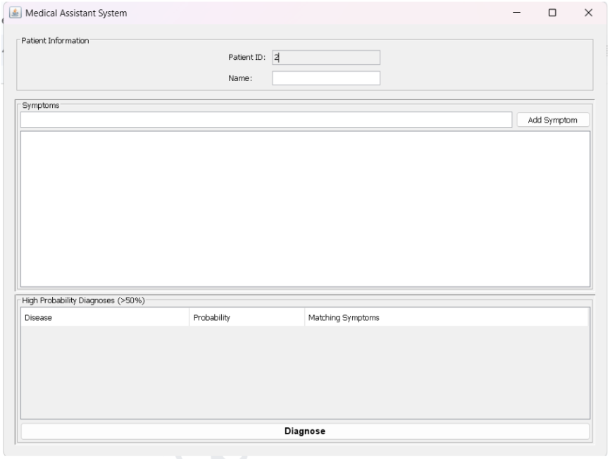
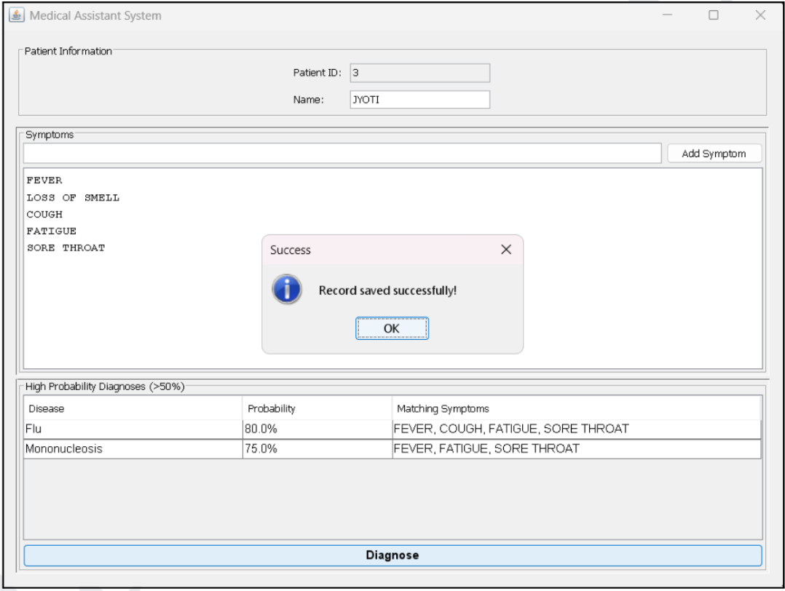
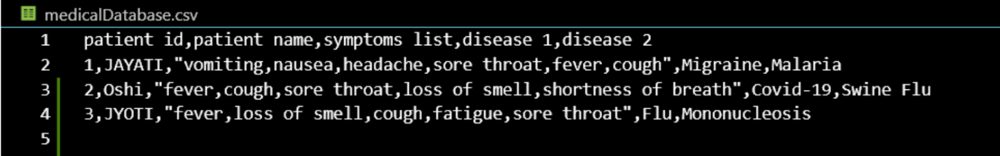

# Medical Assistant System

## Description

This is a simple Java Swing application that acts as a medical assistant. It allows a user to input patient information and symptoms, perform a basic diagnosis based on a predefined knowledge base, and save patient records.

## Screenshots

### Main Interface

*The main window of the Medical Assistant System showing patient information input and symptom management*

### Diagnosis Results

*Example of diagnosis results showing high probability matches*

### Patient Records

*View of saved patient records in the CSV database*

## Features

*   Graphical User Interface (GUI) for easy interaction.
*   Input fields for Patient ID and Name.
*   Ability to add multiple symptoms from a predefined list.
*   Diagnoses based on a probability match against known diseases and their symptoms.
*   Displays the top 2 high-probability diagnoses (>50% match).
*   Saves patient records (ID, Name, Symptoms, Top 2 Diagnoses) to a CSV file.

## Requirements

*   Java Runtime Environment (JRE) installed on your system.
*   The application relies on the following data files:
    *   `symptom.txt`: Contains a list of valid symptoms.
    *   `disease.txt`: Contains a list of diseases and their associated symptoms.
    *   `medicalDatabase.csv`: Stores patient records. This file will be created if it doesn't exist when the first record is saved.

## Installation and Setup

1.  Ensure you have a JRE installed.
2.  Place the `MedicalAssistantGUI.java`, `MedicalDataBase.java`, `symptom.txt`, and `disease.txt` files in the same directory.
3.  Compile the Java files using a Java compiler (like `javac`):

    ```bash
    javac MedicalAssistantGUI.java MedicalDataBase.java
    ```

4.  Run the application using the `java` command:

    ```bash
    java MedicalAssistantGUI
    ```

## Usage

1.  Open the application. A window titled "Medical Assistant System" will appear.
2.  The Patient ID is automatically generated.
3.  Enter the patient's name in the "Name" field.
4.  In the "Symptoms" section, type a symptom into the text field and click "Add Symptom". Repeat for all relevant symptoms. Only symptoms listed in `symptom.txt` are recognized.
5.  Click the "Diagnose" button.
6.  The "High Probability Diagnoses (>50%)" table will display the top 2 diseases that match the entered symptoms with a probability greater than 50%.
7.  The patient record is automatically saved to `medicalDatabase.csv` after a successful diagnosis.

## Data Files

*   `symptom.txt`: Each line should contain a single valid symptom (case-insensitive). Blank lines are ignored.
*   `disease.txt`: Each line should be in the format `Disease Name: symptom1, symptom2, symptom3, ...`. Symptoms should be separated by commas. The mapping is case-insensitive.
*   `medicalDatabase.csv`: This CSV file stores the patient records with columns for Patient ID, Patient Name, Symptoms List (quoted, comma-separated), Disease 1, and Disease 2.

## Potential Improvements

*   Improve the diagnosis algorithm (e.g., using a more sophisticated model).
*   Expand the symptom and disease knowledge base.
*   Add error handling for invalid data file formats.
*   Implement the ability to view past patient records within the GUI.
*   Add a feature to remove symptoms from the list before diagnosis.
